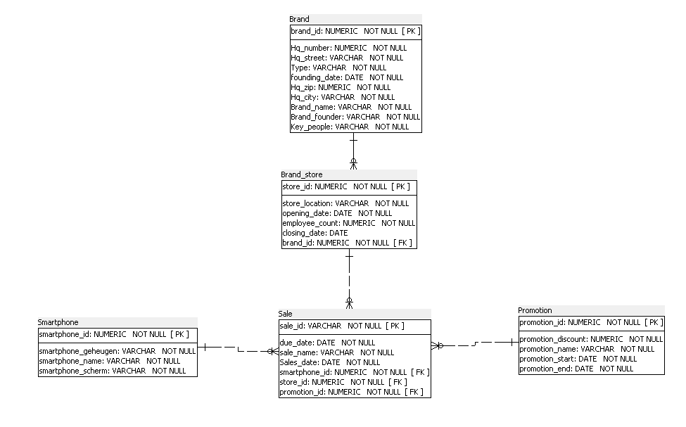

Team: 18

Name: Joppe Dechamps (S1)
Studentnr: 0153912-70
Class: INF202A

Name: Muhammet Murat (S2)
Studentnr: 0154865-53
Class: INF202A

Year: 2023-2024

Milestone 2: Modellering

TOP DOWN MODELERING
---

Entiteittypes + Attributen + PK
---
    S1
- A: users ( **user_ID**, first_name, last_name, email, phone_number, birthdate)
- B: smartphones ( **phone_ID**, phone_name, release_date, screen_diagonal, camera_amount, processor_cores, memory)
- C: reviews ( **user_ID**, **phone_ID**, **postedDate**, **website_ID**, lastEditedDate, title, content, likes, rating)
- D: websites ( **website_ID**, name, web_address)

    S2
- W: promotion ( **promotion_id**, promotion_discount, promotion_name, promotion_start, promotion_end)
- X: brands ( **brand_id**, brand_name,hq_number ,hq_street ,hq_zip ,hq_city ,founding_date)
- Y: brand_stores (**store_id**, brand_id, store_location, employee_count, opening_date, closing_date)
- Z: sale(**sale_id**, store_id, promotion_id, smartphone_id, date_discount, sale_name)

Domeinen - constraints
--- 
    S1
- Review: rating: 0-5
- Website: format: www.\***.\*** / https\://www.\***.\***

    S2
- Promotion: discount <= 100
- Brand: Hq_ip < 0

Tijd 
---
- S1: Time between post and last edit: De Review houdt bij hoe lang het geleden is dat de review gepost is en hoe lang het geleden is dat de review voor het laatst is aangepast.
- S2: Brand has a founding date. All child stores are created after this date. 

Intermediërende  entiteiten
---
- Review: User - Smartphone

Logisch ERD 
---
    S1: ERD

    S2: ERD

informatiebehoefte + Normalisatie
---
    S1:
[informatiebehoefte_S1.pdf](..%2F..%2FD2_NORMALISATIE%2FS1_normalisatie%2Finformatiebehoefte%20S1.pdf)

[S1_normalisatie_smartphones.pdf](..%2F..%2FD2_NORMALISATIE%2FS1_normalisatie%2FS1_normalisatie_smartphones.pdf)

    S2:
[Informatiebehoefte S2.pdf](..%2F..%2FD2_NORMALISATIE%2FS2_normalisatie%2FInformatiebehoefte%20S2.pdf)

[S2_normalisatie_smartphones.pdf](..%2F..%2FD2_NORMALISATIE%2FS2_normalisatie%2FS2_normalisatie_smartphones.pdf)

    SAMEN:
[S1S2_smartphones_Integration.pdf](..%2F..%2FD2_NORMALISATIE%2FSAMEN_integratie%2FS1S2_smartphones_Integration.pdf)

Verschillen na Normalisatie (SAMEN)
-----------------------------------
- Phone - added new attributes: phone_name and storage
- Review - added new attributes: rating and last_edited_date
- Website - changed attribute names from website_url and website_name to web_address and name correspondingly
- added HQ Adresses table

