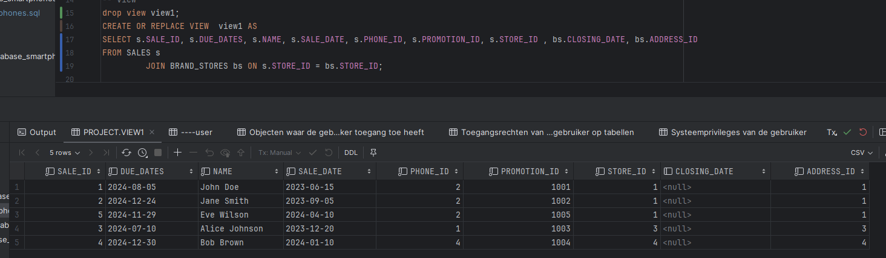
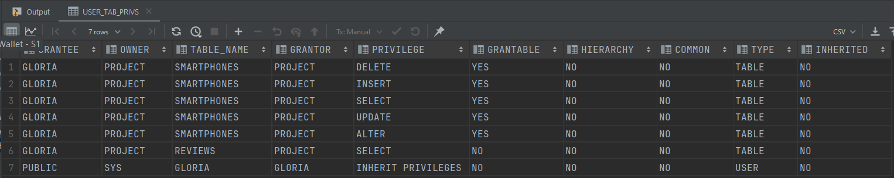
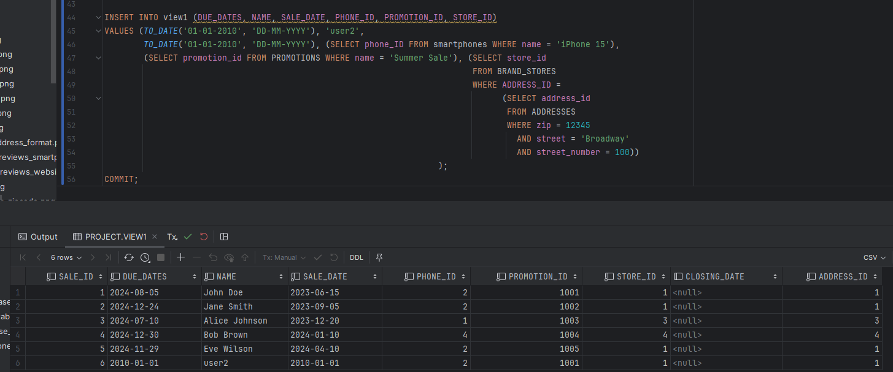

Milestone 3: Creatie Databank en Security
---

    Identity columns
---
- Mandatory
    - A: players: player_id
    - B/X: computergames: game_id
    - x: brands: brand_id
    - y: brand_stores: store_id
    - z: sales: sale_id
- other:
    - Addresses: address_id

      Table Counts
---
     Tablecounts

Queries
--- 
    S1 @query 1: GAMESTUDIO - COMPUTERGAMES (B/X) - PLAYERS (A) - GAMESESSIONS (D) 

    S1 @query 2: PLAYER (A) - GAMESERVERS (C)

    S2 @query 1: brands (X) - brand_stores (Y) - sale (Z) - promotion (W)

    S2 @query 2: brands (x) - Adresses

Bewijs Domeinen - constraints M2
--- 

    S1
- Player: zipcodes - minimum 4 characters

- Computergame: release_date < last_updated

    S2
- Promotion: discount <= 100

- Brand: zip < 0

Security
---
    S1: 
- view 

    S2
- view
   

- overzicht system privileges

- S1: 

- S2:
